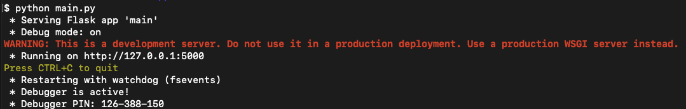

# HbbTV App

## Running the HbbTV App

- Open your terminal
- Navigate in the folder of the HbbTV App
- Run:
```bash
    python main.py
```

If the following message shows up in your terminal, the HbbTV App is ready: 


- Next, copy the URL and open in it your browser (preferably Chrome), where you already installed the HbbTvViewer Plugin (https://github.com/karl-rousseau/HybridTvViewer)

- Once the display ad appears on the screen, you will have the ability to interact with it using the red button.
